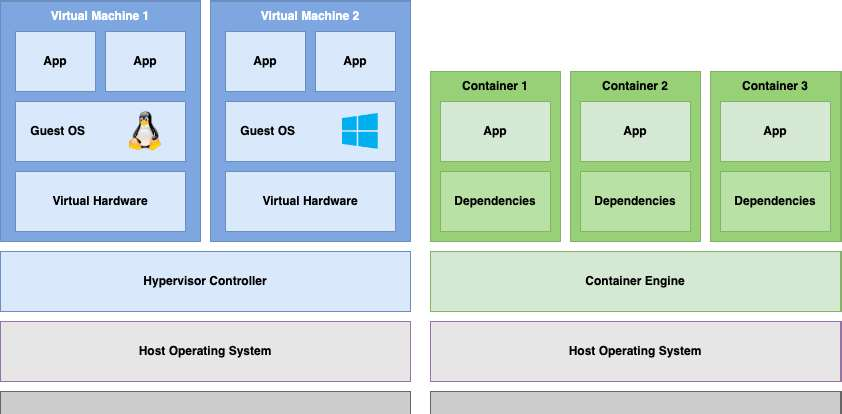
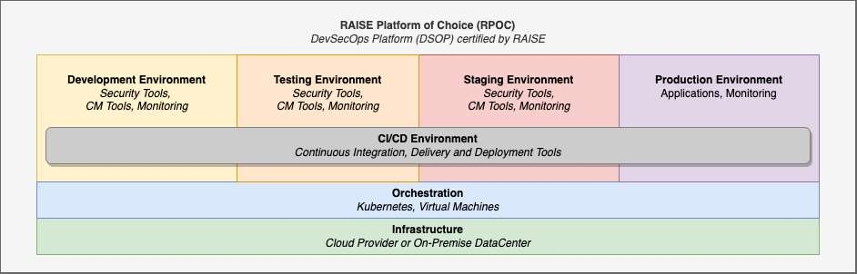
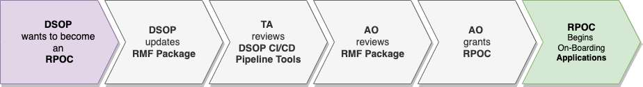
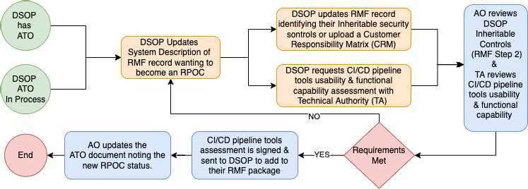

# Rapid Assess and Incorporate Software Engineering (RAISE) 2.0 Implementation Guide

**Version 1.0**  
**Date**: October 4, 2022  
**Classification**: UNCLASSIFIED  
**Author**: RAISE Working Group

---

## Revision History

| Version | Date | Comment | Author |
|---------|------|---------|--------|
| 1.0 | October 4, 2022 | As Released | RAISE Working Group |

---

## Table of Contents

1. [Introduction](#1-introduction)
   - 1.1 [Background](#11-background)
   - 1.2 [Purpose](#12-purpose)
   - 1.3 [Scope](#13-scope)
   - 1.4 [Assumptions](#14-assumptions)

2. [Roles and Responsibilities](#2-roles-and-responsibilities)

3. [Key Terminology](#3-key-terminology)
   - 3.1 [Container](#31-container)
   - 3.2 [Software Development Life Cycle (SDLC)](#32-software-development-life-cycle-sdlc)
   - 3.3 [Security Gates](#33-security-gates)
   - 3.4 [Continuous Integration/Continuous Delivery (CI/CD)](#34-continuous-integrationcontinuous-delivery-cicd)
   - 3.5 [Residual Risk](#35-residual-risk)
   - 3.6 [DevSecOps Platform (DSOP)](#36-devsecops-platform-dsop)
   - 3.7 [RAISE Platform of Choice (RPOC)](#37-raise-platform-of-choice-rpoc)
   - 3.8 [Continuous Monitoring (CONMON)](#38-continuous-monitoring-conmon)
   - 3.9 [Edge Environments](#39-edge-environments)
   - 3.10 [Edge Continuous Monitoring](#310-edge-continuous-monitoring)

4. [RAISE Platform of Choice (RPOC)](#4-raise-platform-of-choice-rpoc)
   - 4.1 [Overview](#41-overview)
   - 4.2 [Requirements](#42-requirements)
   - 4.3 [Transitioning from DSOP to RPOC](#43-transitioning-from-dsop-to-rpoc)
   - 4.4 [RPOC Reviews](#44-rpoc-reviews)
   - 4.5 [Changes to the RPOC ATO](#45-changes-to-the-rpoc-ato)
   - 4.6 [Application Deployment](#46-application-deployment)

5. [Application Owners](#5-application-owners)
   - 5.1 [Overview](#51-overview)
   - 5.2 [Requirements](#52-requirements)
   - 5.3 [Service Level Agreement (SLA)](#53-service-level-agreement-sla)

6. [Security](#6-security)
   - 6.1 [Overview](#61-overview)
   - 6.2 [Acceptable Residual Risk Criteria](#62-acceptable-residual-risk-criteria)
   - 6.3 [Remediation and Mitigation Timelines](#63-remediation-and-mitigation-timelines)
   - 6.4 [Security Gates](#64-security-gates)
   - 6.5 [RMF Controls, SRGs, and STIGs](#65-rmf-controls-srgs-and-stigs)
   - 6.6 [Container Image Signing](#66-container-image-signing)

[Appendices](#appendices)

---

## 1. Introduction

### 1.1 Background

This implementation guide is the continuation of the work performed to generate the RMF RAISE PLAYBOOK. As such, this implementation guide was coined as RAISE 2.0, henceforth referred to as RAISE.

### 1.2 Purpose

The purpose of this document is to enable the Department of Navy (DON) Digital Warfighter to rapidly respond to the evolving demands of cyber warfare and achieve a continuous cyber readiness. To achieve this task, the Department of Defense (DoD) must transform its current processes to facilitate secure and agile delivery of containerized applications to support the warfighter.

To accelerate capability delivery, the Rapid Assess and Incorporate Software Engineering (RAISE) process was developed with Agile & DevSecOps practices in mind to allow an application to be quickly incorporated and deployed using certified Continuous Integration / Continuous Delivery (CI/CD) tools into a production environment's existing Risk Management Framework (RMF) Authority to Operate (ATO) without the need for an application to obtain a separate ATO.

### 1.3 Scope

This implementation guide describes the process for which a DevSecOps Platform (DSOP) can become a Rapid Assess and Incorporate Software Engineering Platform of Choice (RPOC). It outlines the tools, services, processes, people, and culture required to successfully implement tailored cybersecurity processes and delegated authorities by the Authorizing Official (AO) as it pertains to Risk Management Framework.

By embracing the "shift left" philosophy, we are incorporating security teams into all aspects of the Software Development Life Cycle (SDLC), improving overall software application delivery with an emphasis on security and cyber readiness, which in turn, results in faster, safer, and more cost-effective software delivery.

**Applications that are not deployed utilizing container technologies are outside the scope of this guidance.**

### 1.4 Assumptions

For this guide to be successfully implemented, the following assumptions have been made. For additional information on the assumptions, please refer to the references.

1. There is no "one-size-fit-all" solution for DevSecOps. Different CI/CD pipelines will be used depending on the programming language and architecture.

2. A DSOP provides the managed services for the layers described in the DoD DevSecOps Reference Design [5].

3. Applications developed using this process will leverage Open Container Initiative (OCI) compliant containers and Cloud Native Computing Foundation (CNCF) certified container orchestration.

4. When applicable, leveraging pre-existing hardened containers, offered via various approved repositories, can expedite the time from code to production.

5. Application and RPOC teams should be familiar with security technologies as it relates to application container technologies [1].

---

## 2. Roles and Responsibilities

The following table depicts the roles and responsibilities of all parties involved within this implementation guide.

**Table 1: Roles and Responsibilities**

| Role | Responsibility |
|------|----------------|
| **Chief Information Officer (CIO) / Senior Information Security Officer (SISO)** | Responsible for the RMF within the DoD Component cybersecurity program IAW DoDI 8510.01 |
| **Authorizing Official (AO)** | Ensures that the RPOC is meeting the agreed upon acceptable residual risk criteria and issues the authorization |
| **Security Control Assessor (SCA)** | Reviews the containerized applications since the last review and sign the Security Assessment Report (SAR) |
| **Technical Authority (TA)** | Reviews and assess the RPOC CI/CD pipeline tools for usability and functional capability |
| **RPOC Owner** | Responsible for the overall state of the RPOC |
| **RPOC ISSM** | Responsible for the cybersecurity of the RPOC and supports reviews with the AO and SCA |
| **Application Owner** | Responsible for the entire software development lifecycle (SDLC) of the application |

---

## 3. Key Terminology

Terminology can be defined differently depending upon the context and the organization using it. The key terms used throughout this implementation guide, will be defined by the following:

### Containers

Containers represent a lightweight form of virtualization that packages an application and its dependencies together, enabling it to run consistently across different computing environments. Unlike traditional virtual machines, containers share the host system's kernel, making them more efficient in terms of resource utilization.


**Figure 1 Description**: This diagram illustrates the architectural difference between containerized applications and virtual machines. The left side shows the container architecture with multiple containers sharing the same operating system kernel, with each container containing its own application and dependencies (bins/libs). The right side shows the virtual machine architecture where each VM includes a full guest operating system on top of a hypervisor. The container approach is more lightweight as it shares the host OS, while VMs provide stronger isolation with separate OS instances for each application. Both architectures sit on top of physical infrastructure (server hardware).

### 3.2 Software Development Life Cycle (SDLC)

The Software Development Life Cycle (SDLC) is the overall process of developing, implementing, and retiring information systems through a multistep process from initiation, analysis, design, implementation, and maintenance to disposal. There are many different SDLC models and methodologies, but each generally consists of a series of defined steps or phases.

SDLC can be defined as both Software Development Life Cycle and System Development Life Cycle. Both definitions are considered the same and can be used interchangeably.

### 3.3 Security Gates

Security Gates act as the requirements that are the basis of all CI/CD pipelines used within the RAISE process.

### 3.4 Continuous Integration/Continuous Delivery (CI/CD)

Continuous Integration/Continuous Delivery (CI/CD) is a method to frequently deliver applications by introducing automation into all stages of the development.

**Note**: Continuous Delivery is not the same as Continuous Deployment. Continuous Delivery is delivering the application to a release repository, whereas Continuous Deployment will deploy the application into an operational environment.

### 3.5 Residual Risk

Residual risk is the risk that remains after efforts to identify and eliminate some or all types of risk have been made.

### 3.6 DevSecOps Platform (DSOP)

A DevSecOps Platform (DSOP) is defined as a multi-tenet capable platform that offers a significant portion of the software supply chain, operating under an ATO. The components of the DSOP can be configured in many ways and can vary upon mission requirements. The key components of the DSOP includes the environments, the infrastructure, CI/CD tools and the applications.

Each environment within a DSOP can have their own ATO. However, it is the sum of all authorized components and the CI/CD tools that make the DSOP.

### 3.7 RAISE Platform of Choice (RPOC)

Raise Platform of Choice (RPOC) is a designation that a DevSecOps Platform (DSOP) receives after their inheritable security controls have been reviewed and approved by the Authorization Official (AO), and has had their CI/CD pipeline tools usability and functional capabilities reviewed by the Technical Authority (TA).

Each environment within the DSOP can have their own ATO. However, it is the environment that will run the approved application that will become an RPOC. If any RPOC components lose their ATO, or functional capability, the RPOC status must be re-evaluated by the AO. Industry recommends either a 3 or 4 environment platform (Dev, Test, Pre-Prod/Stage, and Production) but it is entirely up to the DSOP on how, and where, they will meet the requirements.

#### Figure 2: Example RAISE Platform of Choice (RPOC)



**Figure 2 Description**: This diagram depicts a complete RPOC architecture showing the flow from development through production. It illustrates four distinct environments (Development, Test, Pre-Production/Staging, and Production) connected through CI/CD pipelines. The diagram shows various components including:
- Code repositories and artifact registries
- CI/CD pipeline tools for building, testing, and security scanning
- Container orchestration platforms in each environment
- Security gates between environments ensuring compliance
- Continuous monitoring across all environments
- The progression of containerized applications through each stage with automated testing and security validation at each gate
This represents the complete software supply chain from code commit to production deployment within a DSOP that has achieved RPOC designation.

### 3.8 Continuous Monitoring (CONMON)

Continuous monitoring refers to the process and technology required to incorporate monitoring across each phase of your DevSecOps process. It helps to continuously ensure the health, performance, reliability and security of your application and infrastructure as it moves from development to production. Continuous monitoring builds on the concepts of DevSecOps which help you develop and deliver software securely, faster, and more reliably to provide continuous value to the mission.

For further information on CONMON, please refer to the DoD DevSecOps Fundamentals Guidebook: DevSecOps Tools & Activities [4].

### 3.9 Edge Environments

Edge environments are deployments that are geographically and/or logically separated from a traditional datacenter or cloud provider. Edge environments can be remote, disconnected, air-gapped or bandwidth restricted. Some examples of Edge environments include Ships, Subs, Planes and Vehicles.

### 3.10 Edge Continuous Monitoring

In the event that the operational containerized software application is running in an Edge environment (e.g., Ships, Submarines, Planes, Vehicles, Tactical), and cannot perform continuous monitoring (CONMON), the requirement can be addressed at the Staging (Pre-Production) environment. The Edge environment will synchronize logs and updates with the stage environment as the mission allows.

---

## 4. RAISE Platform of Choice (RPOC)

### 4.1 Overview

When a DevSecOps Platform becomes a Raise Platform of Choice (RPOC), it confirms that the tools, services, policies, processes, and people across the Software Development Lifecycle (SDLC) have been effectively realized to align with the Agile and DevSecOps methodologies to accelerate capability delivery at the speed of relevance in support of the warfighter.

The RPOC Owner is inclusive of the platform owner and engineering teams in support of the RPOC.

The RPOC Information System Security Manager (ISSM) will work with the application owner to determine if the application is a good candidate to be hosted on their environment.

**⚠️ Failure to adhere to this implementation guide can result in loss of RPOC designation.**

### 4.2 Requirements

The table below depicts the mandatory requirements for the RPOC. This list may change over time but will be the basis of all RPOC requirements moving forward.

**Table 2: RAISE Platform of Choice (RPOC) Requirements**

| ID | Description |
|----|-------------|
| RPOC 1 | must have a current Authorization to Operate (ATO) |
| RPOC 2 | must support the hosting of Containerized Applications |
| RPOC 3 | must support the Orchestration of Containerized Applications |
| RPOC 4 | must support Continuous Monitoring |
| RPOC 5 | must support the execution of the Security Gates |
| RPOC 6 | must maintain a POA&M for the RPOC and Applications |
| RPOC 7 | must support the Quarterly Review with the SCA and AO offices |
| RPOC 8 | must ensure all CI/CD pipelines tools have been certified by the TA |
| RPOC 9 | must ensure the RPOC RMF package remains current |
| RPOC 10 | must maintain Service Level Agreements (SLAs) with Application Owners |
| RPOC 11 | must provide Cyber Security Dashboard(s) for Auditing purposes |
| RPOC 12 | must provide a Container Repository |
| RPOC 13 | must provide a Code Repository |
| RPOC 14 | must perform Container Signing and verification |
| RPOC 15 | must retain every image that is currently deployed |
| RPOC 16 | must support Penetration Testing as requested by AO |
| RPOC 17 | must provide CI/CD pipelines tools |
| RPOC 18 | must only host applications at their approved categorization level and below |
| RPOC 19 | must perform ongoing vulnerability scans on all running containers and/or images |
| RPOC 20 | must ensure that the CI/CD pipeline meet the Security Gates |
| RPOC 21 | must define an application deployment process(es) |
| RPOC 22 | must ensure every release candidate container passes the CI/CD pipeline |
| RPOC 23 | must not allow production deployment of any application(s) that do not meet the SLA requirements |
| RPOC 24 | must provide vulnerability reports and/or vulnerability dashboards for Application Owner review |

### 4.3 Transitioning from DSOP to RPOC

#### Figure 3: DSOP to RPOC Transition



**Figure 3 Description**: This diagram shows the transformation journey from a DevSecOps Platform (DSOP) to a RAISE Platform of Choice (RPOC). It illustrates the key differences and additional requirements:
- Left side shows a standard DSOP with basic CI/CD capabilities, container orchestration, and an ATO
- Middle section shows the evaluation and certification process including security control review, CI/CD tools assessment, and approval gates
- Right side shows the enhanced RPOC with certified CI/CD tools, inheritable security controls, approved security gates, quarterly review process, and elevated authorization status
The transition emphasizes the maturity level increase from basic DevSecOps to a platform capable of rapidly assessing and incorporating applications without separate ATOs.

The following process outlines the required steps for a DevSecOps Platform (DSOP) to become a RAISE Platform of Choice (RPOC).

1. DSOP wanting to become an RPOC must indicate their preference in the RMF package under System Description.
   a) must list the sum of all authorized components that make up your RPOC.

2. Steps (a) and (b) can be performed in parallel:
   
   a) DSOP wanting to become an RPOC must select their security controls as inheritable in their RMF package (preferred) or uses a Customer Responsibility Matrix (CRM) (where applicable) and uploads the CRM to the RMF package.
      1) AO approves Inheritable Security Controls (RMF Step 2 Approval).
   
   b) DSOP wanting to become an RPOC must initiate the DevSecOps CI/CD pipeline tools certification for usability and functional capability assessment request per reference [2] with the Technical Authority (TA).
      1) If criteria in reference [2] is met, TA sends the signed document to DSOP to upload in the RMF tool.

3. AO reviews the CI/CD pipeline tools certification document and updates DSOP Authorization Decision Document to become an RPOC.

4. RPOC must be re-evaluated for security relevant changes to their environments or tools.

#### Figure 4: A DSOP becoming an RPOC Process Flow



**Figure 4 Description**: This flowchart details the step-by-step process for a DSOP to achieve RPOC designation. The diagram shows:
- Starting point: DSOP with active ATO
- Parallel paths for: (1) Security controls review and approval, and (2) CI/CD tools certification by Technical Authority
- Decision points for approval gates
- Convergence at AO review and authorization decision
- Final designation as RPOC
- Ongoing re-evaluation loop for maintaining RPOC status
The process includes feedback loops for cases where requirements are not met, showing iterative improvement paths. Key stakeholders (DSOP Owner, AO, SCA, TA) are clearly indicated at each decision point.

### 4.4 RPOC Reviews

The RPOC Owner is required to support cyber readiness by ensuring that it has an active continuous monitoring strategy in place for the applications that are onboarded using the RAISE process. To facilitate this requirement, quarterly reviews will be required between the RPOC ISSM, the SCA, and the AO. The RPOC ISSM will support reviews on the status of risk and compliance, effectiveness, and changes to applications on their platform.

#### 4.4.1 Quarterly Reviews

The Quarterly Review has been designed as a periodic check for the AO to ensure that the RPOC is meeting the agreed upon Acceptable Residual Risk Criteria. The Quarterly Review is subject to only the changes that have occurred since the last review; these changes include application onboarding and offboarding. Changes that have occurred within 30 days of the review date, will be assessed during the next Quarterly Review.

The Security Control Assessor (SCA) must review the RPOC RMF package deltas and sign the Security Assessment Report (SAR) prior to the meeting with the AO. The SAR can be signed with open action items that could require further review. All Information gathered during the review must be recorded within the RPOC RMF package. The final discussion item of the Quarterly Review will be the AO informing the RPOC ISSM with a date for the next Quarterly Review.

**Note**: It is recommended that the reviews begin quarterly but can become less frequent once a working relationship between the RPOC ISSM and AO has been established.

#### Figure 5: Quarterly Review Process Workflow



**Figure 5 Description**: This workflow diagram illustrates the quarterly review cycle for maintaining RPOC authorization. The process flow shows:
- Pre-review preparation phase: RPOC ISSM gathers required documentation (security plans, vulnerability reports, application deployment artifacts)
- SCA review phase: Security Control Assessor reviews RMF package deltas and prepares/signs Security Assessment Report
- AO review meeting: Authorizing Official meets with RPOC ISSM and SCA to review:
  - Application changes (new deployments, removed applications)
  - POA&M status updates
  - Vulnerability trends and remediation efforts
  - Compliance with security gates
  - Overall risk posture
- Decision point: AO determines if RPOC continues to meet acceptable residual risk criteria
- Post-review actions: Schedule next review, update RMF package, address any open items
The diagram emphasizes the continuous nature of the review cycle with feedback loops for addressing deficiencies.

The table below depicts the mandatory data requirements for the Quarterly Review. This list may change over time but will be the basis of all Quarterly Review requirements moving forward.

**Table 3: Quarterly Review Requirements**

| ID | Description |
|----|-------------|
| QREV 1 | Security Plan to include:<br>- Software List<br>- Architectural Diagrams of the RPOC<br>- Ports, Protocols, and Services Management (PPSM) |
| QREV 2 | Security Assessment Plan (SAP) |
| QREV 3 | Privacy Impact Assessment (PIA) |
| QREV 4 | Plan of Actions and Milestones (POA&M) and corresponding Security Controls |
| QREV 5 | Report of all newly deployed or removed applications, via the RAISE process |
| QREV 6 | Consolidated vulnerabilities report of all applications deployed, via the RAISE process |
| QREV 7 | Application Deployment Artifacts to include:<br>- Security Requirements Guide (SRG) and Security Technical Implementation Guide (STIG)<br>- SAST Report<br>- DAST Report<br>- Container Security Scan Report<br>- Dependency Report/Software Bill of Materials (SBOM) |

**Note**: The Security Assessment Plan (SAP) is not required to be approved by the Security Control Assessor (SCA).

#### 4.4.2 Annual Reviews

Per existing RMF processes, the AO will perform an annual review of the RPOC ATO. This process falls outside of the scope of this implementation guide. Additionally, during the annual review, the AO will review the state of the RPOC to include any of the components that comprise the RPOC.

### 4.5 Changes to the RPOC ATO

If the RPOC Owner wishes to make a change to their ATO, they must follow existing RMF processes to perform the update. This process falls outside of the scope of this implementation guide.

### 4.6 Application Deployment

It is the responsibility of the RPOC ISSM to define the process(es) to deploy an application from the Artifact Release Repository to the Production environment. It then becomes the responsibility of the Application Owner to ensure that all processes are followed for every application deployment.

---

## 5. Application Owners

### 5.1 Overview

Software Development Teams are the foundation of a solid DevSecOps program, essential to the creation (and security) of rapidly developed applications critical to warfighter requirements. Application Owner is inclusive of the DevSecOps teams and program office (PO).

**Note**: An application owner who requires an exception to this implementation guide must be escalated through respective service chains of command to the appropriate Deputy DON Senior Information Security Officer as required to resolve in a timely manner.

### 5.2 Requirements

The table below depicts the mandatory requirements for the Application Owner. This list may change over time but will be the basis of all Application Owner requirements moving forward.

**Table 4: Application Owner Requirements**

| ID | Description |
|----|-------------|
| APPO 1 | is responsible for the entire Software Development Life Cycle (SDLC) |
| APPO 2 | application residual risk must not exceed the criteria as outlined in this implementation guide |
| APPO 3 | applications must be registered in DADMS or equivalent system |
| APPO 4 | must provide the DADMS ID and DITPRDON ID or equivalent system tracking ID for higher classification to the RPOC ISSM |
| APPO 5 | must provide Security Categorization Form (SCF) (where applicable) |
| APPO 6 | must provide a Privacy Impact Assessment (PIA) Form |
| APPO 7 | must review and remediate, or mitigate, all findings listed in the vulnerabilities report per the timelines defined within this guide |
| APPO 8 | must provide the RPOC ISSM mitigation or remediation statements for all findings related to the application |
| APPO 9 | application(s) deployments must successfully pass through all Security Gates |
| APPO 10 | must provide and continuously maintain a complete Security Requirements Guide (SRG) and Security Technical Implementation Guide (STIG) |
| APPO 11 | must notify the RPOC ISSM when new application features or major updates are implemented |
| APPO 12 | must respond to all notifications from the RPOC per their SLA |
| APPO 13 | must coordinate with RPOC ISSM to implement their CI/CD pipeline |
| APPO 14 | is responsible for the CI/CD pipeline implementation, per the SLA |
| APPO 15 | must coordinate with RPOC ISSM if new tools or services are required |
| APPO 16 | must build and maintain the following documentation:<br>- Vulnerability Management Plan<br>- Application Architecture<br>- README<br>- CHANGELOG (Release Notes)<br>- Aggregated scan results for: SAST (for custom source code), DAST, Container Security, Dependencies/Software Bill of Materials (SBOM). |
| APPO 17 | must provide the required documentation to the RPOC ISSM as agreed upon in the SLA |
| APPO 18 | must have a signed Service Level Agreement (SLA) with the RPOC Owner |
| APPO 19 | must ensure every release candidate container passes the CI/CD pipeline |

### 5.3 Service Level Agreement (SLA)

A signed Service Level Agreement (SLA) must be in place between the RPOC Owner and the Application Owner. The SLA will be defined during the framing and discovery stage of the onboarding process. The SLA will be based upon the RPOC requirements and should be tailored to the Application Owner. Appendix C provides an example of an SLA.

---

## 6. Security

### 6.1 Overview

Security is everyone's responsibility – thus security must be as portable as the containers themselves, so organizations should adopt techniques and tools that are open and work across platforms and environments. Developers build in one environment, test in another, and deploy in a third, so having consistency in assessment and enforcement is important. Continuous integration and deployment practices alter the traditional walls between phases of the development and deployment cycle, so organizations need to ensure consistent, automated security practices across creation of the container image, storage of the container image in registries, and running of the container images.

### 6.2 Acceptable Residual Risk Criteria

The acceptable residual risk criteria of an RPOC is defined as: **All findings and vulnerabilities of an application must be mitigated with a residual risk not exceeding Moderate.** Applications that cannot meet the acceptable risk criteria will be escalated through the respective AO's.

**Note**: High Risk applications falls outside the scope of this Implementation Guide. High Risk applications will need to follow existing RMF processes.

### 6.3 Remediation and Mitigation Timelines

Vulnerability identification employs security automation capabilities to identify possible vulnerabilities in organizational assets. These capabilities, combined with security control methodologies, provide additional means to identify vulnerabilities. Remediation and mitigation timeline requirements are defined as:

1. **Applications in a production environment that have newly discovered raw findings of high, and above, are expected to be remediated, or mitigated, within 21 calendar days.**
   
   a) It is the responsibility of the RPOC ISSM, in coordination with the Application Owner, to isolate/remove offending workloads/containers from the production environment that surpasses 21 calendar days.
   
   b) If an exception is required to this rule, the AO must be notified.
   
   c) The mitigation of raw findings high, and above, must be reviewed by the RPOC Qualified Validator, or Independent Assessor.

2. **Applications in a production environment that have newly discovered findings are expected to be remediated, or mitigated, per the SLA.**

### 6.4 Security Gates

#### 6.4.1 Overview

The CI/CD pipeline certified tools are meant to provide a high level of testing fidelity and confidence which is only achieved with continuous automation of tests throughout the SDLC of the application. It is the RPOC ISSM's responsibility, in coordination with the Application Owner, to review the test results and ensure that the acceptable residual risk criteria is met. The RPOC ISSM will monitor the CI/CD pipelines to ensure that they are implemented as described in this guide.

#### 6.4.2 CI/CD Pipeline Implementation

The CI/CD pipeline can be implemented by the Application Owner, the RPOC Owner or a combination of both. As such, the RPOC ISSM will determine who will be responsible for implementing the CI/CD pipeline and will document it in the Service Level Agreement (SLA).

#### 6.4.3 Commercial of the Shelf Software (COTS)

Static Application Security Testing (SAST) is a vulnerability scanning methodology designed to work on custom source code rather than a compiled executable or COTS software. For COTS software SAST reports are not required.

#### 6.4.4 Requirements

The table below depicts the mandatory requirements that the CI/CD pipeline must perform to meet the Security Gates. This list may change over time but will be the basis of all Security Gates moving forward.

**Table 5: Security Gate Requirements**

| ID | Description |
|----|-------------|
| GATE 1 | must provide Static Application Security Testing (SAST) for available source code |
| GATE 2 | must provide Dependency List or Software Bill of Materials (SBOM) |
| GATE 3 | must provide Secrets/Keys Detection |
| GATE 4 | must provide Container Security Scanning (CSS) |
| GATE 5 | must provide Dynamic Application Security Testing (DAST) |
| GATE 6 | must provide a step to allow the RPOC ISSM to review |
| GATE 7 | must sign the release container image |
| GATE 8 | must store the release container image in an artifact repository |

**Note**: The Security Gates listed above are in no specific order. Application Owners may have unique requirements based upon their specific application and they should be discussed during the onboarding phase.

#### 6.4.5 Results

The results of the CI/CD pipeline must be made available for review to the RPOC ISSM, SCA and AO, as needed. The final release results of the application will be uploaded into the RMF package tool, which will inform the RPOC ISSM, SCA and AO with real time information for application risk assessment.

A near real-time status of the current security posture, risk score, and results from the CI/CD pipeline for the production applications will be accessible by the Application Owner and SCA/AO via a dashboard and/or an Application Programming Interface (API).

### 6.5 RMF Controls, SRGs, and STIGs

The RPOC ISSM will work with the Application Owner to determine what SRGs and STIGs need to be accounted for. The RPOC ISSM will also provide a list of all Controls that must be addressed prior to the application deployment. The resulting documentation will be provided to the RPOC ISSM by the Application Owner as outlined in the SLA.

### 6.6 Container Image Signing

For a Container to be approved for deployment, it must be signed by the RPOC to ensure the RPOC ISSM has reviewed the container. The RPOC ISSM will ensure the correct policies are enforced allowing only signed containers to be deployed to the platform.

---

## Appendices

### Appendix A: Lexicon

| Acronym | Definition |
|---------|------------|
| **AO** | Authorizing Official |
| **Application** | A software program hosted by an information system |
| **ATO** | Authorization to Operate |
| **CI/CD** | Continuous Integration / Continuous Delivery |
| **DSOP** | DevSecOps Platform |
| **IaaS** | Infrastructure as a Service |
| **Information System** | (44 U.S.C., Sec. 3502) defines an information system as "a discrete set of information resources organized for the collection, processing, maintenance, use, sharing, dissemination, or disposition of information hardware, software, information, data, applications, communications, and people." [3] |
| **OSS** | Open-Source Software |
| **OCI** | Open Container Initiative |
| **CNCF** | Cloud Native Computing Foundation |
| **PaaS** | Platform as a Service |
| **POA&M** | Plan of Action and Milestones |
| **Residual Risk** | Residual risk is the risk that remains after efforts to identify and eliminate some or all types of risk have been made. |
| **RAISE** | Rapid Assess and Incorporate Software Engineering |
| **RPOC** | Raise Platform of Choice |
| **SBOM** | Software Bill of Materials |
| **SLA** | Service Level Agreement |
| **Software** | Computer programs and associated data that may be dynamically written or modified during execution |
| **Software Supply Chain** | A Software Supply Chain is anything that affects your software. A supply chain is anything that's needed to deliver your product—including all the components you use. |

### Appendix B: References

1. [NIST Special Publication 800-190 - Application Container Security Guide](https://doi.org/10.6028/NIST.SP.800-190)

2. Development, Security, Operations (DevSecOps) Continuous Integration (CI) / Continuous Delivery (CD) Assessment Guidebook v1.0, Jun 2021

3. [NIST Glossary](https://csrc.nist.gov/glossary/term/)

4. [DevSecOps Fundamentals Guidebook: DevSecOps Tools & Activities](https://dodcio.defense.gov/Portals/0/Documents/Library/DevSecOps%20Fundamentals%20Guidebook-DevSecOps%20Tools%20and%20Activities_DoD-CIO_20211019.pdf)

5. [DoD Enterprise DevSecOps Reference Design](https://dodcio.defense.gov/Portals/0/Documents/Library/DevSecOpsReferenceDesign.pdf)

### Appendix C: Example Service Level Agreement (SLA)

The below information can be used as the basis for a new SLA, or to be incorporated into an existing SLA.

1. Application Owner is responsible for the full lifecycle of the software application from inception to decommissioning from the RPOC.

2. Applications that do not meet the residual risk criteria as outlined in the RAISE Implementation Guide are not allowed to be deployed in, or could be removed from, production environments.

3. Application Owner must register their containerized software application on DADMS and DITPRDON or equivalent system tracking ID for higher classification.

4. Application owner must provide the RPOC ISSM with the DADMS and DITPRDON information.

5. Application Owner must provide Security Categorization Form (SCF) (where applicable).

6. Application Owner must provide a Privacy Impact Assessment (PIA) Form.

7. Application owner will receive weekly vulnerability reports or access to a monitoring dashboard from the RPOC.

8. Application owner must review, remediate, and mitigate all findings listed in the RPOC vulnerabilities weekly report per the timelines outlined in the RAISE Implementation Guide.

9. Application owner must provide clear remediation / mitigation information for all findings to the DSOP's ISSM to track in their POA&M.

10. All application changes must pass the CI/CD pipeline quality gates before they can deploy into the production environment.
    
    a) If all tests pass, the application is placed in the Artifact Release Repository awaiting deployment.

11. Application Owner must provide and continuously maintain a complete Secure Requirements Guide (SRG) and Secure Technical Implementation Guide (STIG) to the RPOC ISSM.

12. Application Owner must notify the RPOC ISSM when new application features and major updates are implemented. (e.g., use of a new language, new framework, additional services, additional interfaces, etc.).

13. Application Owner must respond to all notifications from the RPOC.

14. Application Owner must coordinate with the RPOC ISSM to implement the CI/CD pipeline requirements as outlined in the RAISE Implementation Guide.

15. It is the responsibility of the Application Owner to configure their own specific pipeline working in conjunction with the RPOC Owner. In the future a central team may be established to set up and manage standard pipelines on behalf of the application owners.

16. The addition of new tools should be coordinated with the RPOC ISSM when existing tools are unable to meet the requirements of the DevSecOps policy due to a capability deficiency. Additionally, the replacement of any RPOC tools should be coordinated with the SCA, AO, following the existing processes.

17. Application Owner must build the following application security and implementation documentation as a part of inception and maintain it going forward:
    
    a) **Vulnerability Management Plan**: Describes the application vulnerability management strategy for the application.
    
    b) **Release Plan**: Describes the frequency and processes the Application Owners will utilize to deploy the Application.

18. Application Owners must provide the following documents for every release of the application:
    
    a) **README**: Describes the procedures to build and test the application manually on a local machine. This allows the ISSM to manually check the application and helps onboard new developers to the team. This file resides within the code repository as a part of the project.
    
    b) **Application Architecture**: A high-level application architecture diagram depicting the relationship between application components, application user connections and data flows, and any external system connections and data flows required.
    
    c) **CHANGELOG (Release Notes)**: Information about the latest changes of the application. Release notes must show a historical record of all changes deployed into the production environments for each version, at a high level.
    
    d) **Scan Results**: Aggregated report of results from; SAST (for custom source code), DAST, Container Security, Dependencies/Software Bill of Materials (SBOM).
    
    e) **Mitigation Statements**: Aggregated report mitigation statements that conform to the SCA Risk Assessment Guide for all open vulnerabilities must be provided to the RPOC ISSM for review and action prior to each release. The mitigation statements are meant to support the quarterly reviews between the RPOC ISSM and the AO.

19. A signed Service Level Agreement (SLA) must be in place between the RPOC Owner and the Application Owner.

20. Application Owner must ensure every release candidate container passes the CI/CD pipeline successfully

21. Application Owner will not be allowed to deploy in production if the SLA requirements are not met

### Appendix D: Example CI/CD Pipeline Tools Certification Request Template

The below information can be used as the template by the future RPOC's requesting their CI/CD tools assessed by the TA.

```
From:    <ORGANIZATION NAME> (EX: Naval Information Warfare 
         Systems Command)
To:      <ORGANIZATION NAME> Technical Authority
Cc:      <AUTHORIZING OFFICIAL>

Subj:    <PLATFORM NAME HERE> with <EMASS/MCAST ID> is requesting
         certification for usability and functional capability of their
         Continuous Integration / Continuous Delivery (CI/CD) pipeline
         tools.

Ref:     (a) Rapid Assess and Incorporate for Software Engineering
             (RAISE) Platform of Choice (RPOC) Guidance
         (b) Navy Risk Management Framework (RMF) Process Guide

1. In accordance with reference (a) and (b), <ORGANIZATION NAME>
   requests <PLATFORM NAME> to become a RAISE Platform of Choice.

   a) <PLATFORM NAME> has an <active / seeking> (pick one) <ENTER
      EMASS/MCAST ID> authorization with a security category
      impact levels of <ENTER SECURITY LEVEL> (EX: Moderate-
      Moderate-Moderate) for Confidentiality, Integrity, and
      Availability, respectively; and at a classification level
      of up to and including <ENTER CLASSIFICATION> (EX:
      Unclassified) as described in the Security Plan.

   b) <PLATFORM NAME HERE> seeking to become an RPOC is comprised
      of the following components (if RPOC is a sum of multiple
      authorized components):
      
      a) <COMPONENT NAME> (EX: Dev Environment) with
         <EMASS/MCAST ID>, is included as a component of the
         RPOC.
      
      b) <COMPONENT NAME> (EX: Tools Environment) with
         <EMASS/MCAST ID>, is included as a component of the
         RPOC.
      
      c) (Add additional entries that make up your full RPOC –
         dev environment ATO, tools ATO, production ATO etc.…)

   c) <PLATFORM NAME> with a <EMASS/MCAST ID> seeking
      certification for usability and functionality of the CI/CD
      pipeline tools listed below:
      
      a) <TOOL NAME - VERSION>.
      b) <SERVICE NAME - VERSION>.
      c) (add additional tools / services) …


__________________                 ___________________
First Name / Last Name             Date

<ORGANIZATION NAME> <PLATFORM NAME>
Information Systems Security Manager (ISSM)
```

---

**Document Classification**: UNCLASSIFIED  
**End of Document**
